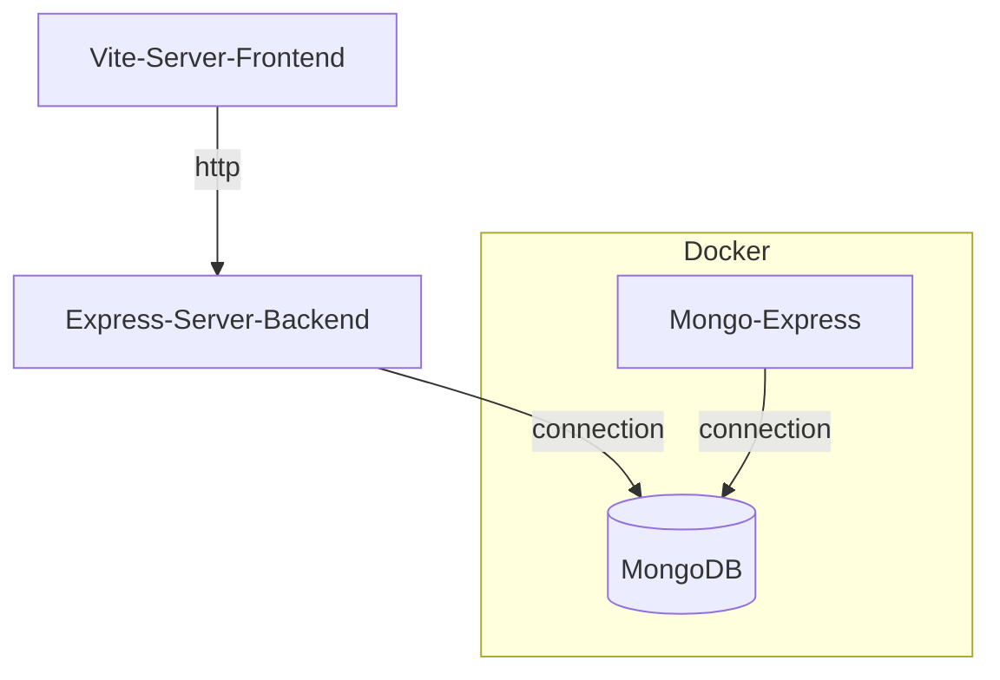
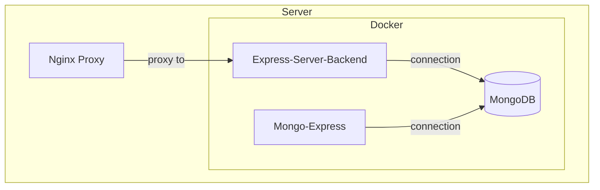

# React + Vite

This template provides a minimal setup to get React working in Vite with HMR and some ESLint rules.

Currently, two official plugins are available:

- [@vitejs/plugin-react](https://github.com/vitejs/vite-plugin-react/blob/main/packages/plugin-react/README.md) uses [Babel](https://babeljs.io/) for Fast Refresh
- [@vitejs/plugin-react-swc](https://github.com/vitejs/vite-plugin-react-swc) uses [SWC](https://swc.rs/) for Fast Refresh


When we collect data, the web app will be run on a server, so everyone can interact with the same instance. But for development, you will need to follow these steps to run the web app on your own device.

## Development

For development, please follow the instructions below.

### TL;DR

```
cp base.env .env
npm i
docker compose up -d
npm run dev
```

### Step 1: Set local environment variables

Create a `.env` file and copy all from `base.env`.
Update the variables in `.env` according to your preferences and development environment.

```
cp base.env .env
```

### Step 2: Install dependencies using NPM

1. Make sure NPM is installed or install it from [here](https://www.npmjs.com/). 
2. Navigate to the directory containing this project and install the dependencies:

    ```
    npm i
    ``` 

    You may need to run `npm i --force`.

### Step 3: Install and initialize Docker
In addition to the NPM dependencies, we will be using:
- Node.js, which will run our JavaScript application.
- MongoDB, our database.
- MongoExpress, an interface used to interact with MongoDB on the web.

It would be time-consuming to install and configure all of these on your computer. Importantly, if you use **Windows**, you will need to download the Windows Subsystem for Linux (WSL) from the Microsoft Store.

1. Make sure [Docker](https://docs.docker.com/get-docker/) is installed and setup
2. Navigate to the directory containing this project and run:

    ```
    docker compose build
    ```

### Step 4: Start development

1. Start up the required development infrastructure:
    ```
    docker compose up
    ``` 
    or 
    ```
    docker compose up -d
    ```

    > Note: You can run `docker container ls` to see a list of your containers. Learn more about Docker commands [here](https://docs.docker.com/engine/reference/commandline/container_ls/).

2. Start the React frontend:
    ```
    npm run dev
    ```

### Step 5: Stop development

1. (Optional) Dump the database to a CSV file:
    ```
    node mongo_to_csv.js
    ```

2. Stop development infrastruture by running:

    ```
    docker compose stop
    ```

### Overview components in development

During development, these are the components:



# Environment Variables

| Var | Description | When to set |
|---|---| --- |
| `VITE_LINK_REDIRECT_TO_URL_ON_SURVEY_SUBMISSION` | The URL to which the survey should redirect when survey is submitted. For example, it might be the receiving URL of Prolific. | Always |
| `VITE_SURVEY_DATA_EXPIRE_DAYS` | Expiration of survey data in the browser's local storage in days | Always |
| `DOCKER_DEPLOY_IMAGE_NAME` | The name of the deployment ready docker image. | Before building the deployment docker image |
| `MONGO_USERNAME` | username with root access | Always|
| `MONGO_PASSWORD` | password for username | Always|
| `MONGO_HOST` | hostname where MongoDB is reachable (usually localhost) | Always|
| `MONGO_HOST_PORT` | port on host where MongoDB is reachable | Always|
| `ME_ADMIN_USERNAME` | username for MongoDB Express | Always |
| `ME_ADMIN_PASSWORD` | password for MongoDB Express | Always |
| `EXPRESS_PORT` | port where express server is running (serving the survey in production) | Always |

# Deployment

## Deploy as Docker Image

1. Navigate to the root directory of this repository
2. Create a `.env` file with all required environment variables. Use the `base.env` file to get started.
3. Run in terminal:
    ```
    npm install && \
    npm run build && \
    set -a && source .env && set +a && \
    docker build -t "$DOCKER_DEPLOY_IMAGE_NAME" -f docker-deploy-as-image/Dockerfile .
    ```

4. Copy the following files to the host where you want to run the survey:
    - `docker-deploy-as-image/docker-compose.yml` --> `docker-compose.yml`
    - `.env` --> `.env`

5. Update all variables' in these files to match your deployment environment.

6. Run in terminal on deployment host:
    ```
    docker compose up
    ```

7. Setup additional software, such as nginx to proxy traffic to the survey.

## Deploy as Git Repository

1. Clone this git repository to the server where you want to serve the survey from
2. Create a `.env` file with all required environment variables. Use the `base.env` file to get started.
3. Run in terminal:
    ```
    npm install && \
    npm run build
    ```
6. Run in terminal on deployment host:
    ```
    docker-compose up
    ```

7. Setup additional software, such as nginx to proxy traffic to the survey.

## Deployment architecture

A deployment typically looks something like this:



# Input Prolific ID

To add a prolific ID to the start of the survey, you can edit the url to add:
```
http://localhost:5173/?PROLIFIC_PID=[ID_HERE]
```
Where [ID_HERE] is the prolific ID.

# Need More Help?

Be sure to check the wiki for additional tutorials on how to modify your survey.

Otherwise, please add an issue to this repo.